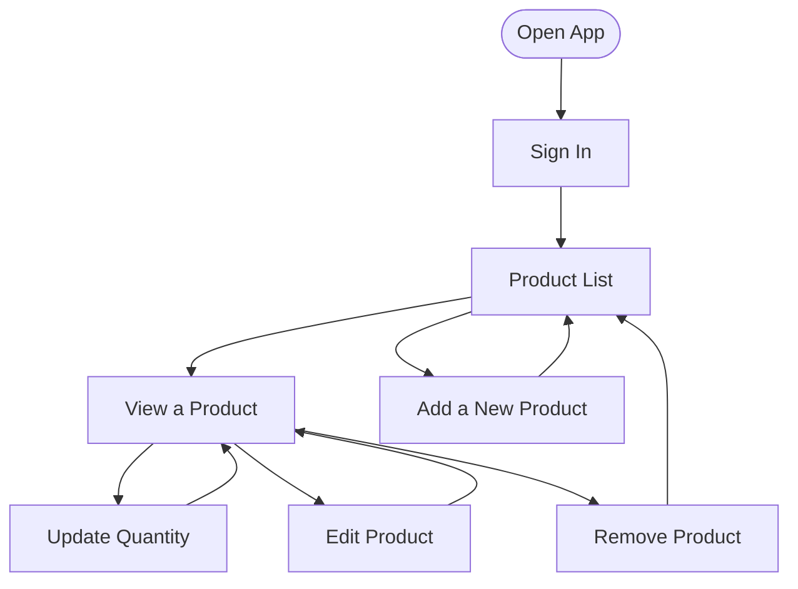

# InventoryHub

A web app for warehouse teams to manage their product catalog. Team members log in and can view, add, edit, and remove products. All changes are saved to a shared cloud database in real time.

---

## What the App Does

A warehouse team uses this app to keep track of their products. After logging in, team members can:

- **Browse** a product list with name, category, price, and quantity
- **Add** new products with a name, description, price, quantity, category, and image
- **View** full product details, including who created or last edited it
- **Adjust** stock quantity using +/- buttons or by typing directly
- **Edit** any product's details or swap its image
- **Remove** a product — but only when its quantity is 0, so in-stock items can't be deleted by accident

Everyone on the team sees the same catalog.

---

## User Flow



---

## Features

### Login

- Sign in with email and password
- Empty fields and invalid emails are caught before sending to the server
- On success, you are taken to the product list automatically

### Product List

The first page you see after login. Lists all products in a table.

- **Search** — type a product name and press Enter; click the X to clear
- **Filter by category** — use the dropdown to show only one category
- **Sort** — click any column header to sort up or down
- **Show/hide columns** — use the Columns button to pick which columns appear
- **Pagination** — choose 5, 10, or 25 rows per page
- **Out-of-stock highlight** — rows where quantity is 0 are highlighted in amber so they stand out
- **Loading skeletons** — placeholder rows appear while data loads
- Click any row to open that product's detail page

### Product Detail

Shows all the information for one product.

- Use +/- or type to change the quantity — changes are not saved until you click **Update**
- Click **Edit** to open the edit form
- Click **Remove** to delete the product — this button is greyed out if quantity is above 0
- A confirmation dialog appears before the product is removed
- A toast message confirms when the quantity is saved
- The bottom of the page shows who created and last edited the product

### Create Product

Form to add a new product.

- Required fields: name, price, quantity, category
- Optional: description, image (JPEG, PNG, GIF, or WEBP, max 5 MB)
- Price is entered in RM (e.g. `12.50`)
- A preview of the image is shown after selecting a file
- If you try to leave with unsaved changes, the browser will warn you

### Edit Product

Same form as Create, but filled in with the existing product's data.

- The **Save** button is only enabled when something has actually changed
- Uploading a new image replaces the old one and removes it from storage
- Removing the image takes effect when you save the form
- If you try to leave with unsaved changes, the browser will warn you

---

## Tech Stack

| Technology            | Version | What it's used for                  |
| --------------------- | ------- | ----------------------------------- |
| React                 | 19      | Building the UI                     |
| TypeScript            | 6       | Type safety, no `any`               |
| Vite                  | 8       | Dev server and build tool           |
| Material UI (MUI)     | 9       | Ready-made UI components            |
| Tailwind CSS          | 4       | Extra styling where MUI falls short |
| React Router DOM      | 7       | Page navigation (HashRouter)        |
| React Hook Form       | 7       | Form state and validation           |
| Supabase JS           | 2       | Auth, database, and file storage    |
| Vitest                | 4       | Unit tests                          |
| React Testing Library | 16      | Component testing                   |
| pnpm                  | latest  | Package manager                     |

---

## Getting Started

### What You Need

- Node.js 24+
- pnpm — install with `npm install -g pnpm`
- A Supabase project — the free tier is enough

### 1. Clone and Install

```bash
git clone https://github.com/tmy-96/tmy-96.github.io.git
cd tmy-96.github.io
pnpm install
```

### 2. Set Up Environment Variables

Copy the example env file:

```bash
cp .env.example .env
```

Open `.env` and fill in your Supabase credentials:

```
VITE_SUPABASE_URL=your_supabase_project_url
VITE_SUPABASE_ANON_KEY=your_supabase_anon_key
```

**How to find these values:**

1. Go to [supabase.com](https://supabase.com) and sign in (or create a free account)
2. Open your project (or create a new one)
3. In the left sidebar, go to **Project Settings** → **Data API**
4. Copy the **Project URL** → paste as `VITE_SUPABASE_URL`
5. Copy the **anon / public** key → paste as `VITE_SUPABASE_ANON_KEY`

> The `anon` key is safe to use in a frontend app. All data access is controlled by database rules (RLS), not by keeping the key secret.

### 3. Set Up the Database

Run the SQL script from the [Database Setup](#database-setup) section below in your Supabase SQL Editor. It creates:

1. The `categories` and `products` tables
2. Row Level Security policies
3. A function to look up user display names
4. 3 preset user accounts
5. 6 preset categories
6. A storage bucket for product images

### 4. Run the App

```bash
pnpm dev
```

Open [http://localhost:5173](http://localhost:5173) and log in with one of the preset accounts below.

### 5. Other Commands

| Command          | What it does           |
| ---------------- | ---------------------- |
| `pnpm test`      | Run unit tests         |
| `pnpm typecheck` | Check TypeScript types |
| `pnpm lint`      | Run linter             |
| `pnpm build`     | Build for production   |
| `pnpm deploy`    | Deploy to GitHub Pages |

---

## Test Accounts

| Email                  | Password    | Display Name |
| ---------------------- | ----------- | ------------ |
| user1@inventoryhub.com | password123 | User One     |
| user2@inventoryhub.com | password123 | User Two     |
| user3@inventoryhub.com | password123 | User Three   |

All accounts share the same product catalog.

## Preset Categories

Electronics, Clothing, Food & Beverages, Furniture, Stationery, Others

---

## Project Structure

```
src/
  types/
    product.ts                    # Product and ProductFormData types
    category.ts                   # Category type
  lib/
    supabase.ts                   # Supabase client setup
  constants/
    imageUpload.ts                # Allowed image types and size limits
    security.ts                   # UUID and email patterns
  utils/
    auth.ts                       # Auth helpers
    formatters.ts                 # Format price (cents → RM X.XX)
    inputSanitizers.ts            # Clean up user input before queries
  hooks/
    useAuth.ts                    # Login, logout, auth state
    useProducts.ts                # List, create, update, soft-delete products
    useCategories.ts              # Load categories (cached after first fetch)
    useProductImageStorage.ts     # Upload, delete, and get image URLs
    useUserNames.ts               # Resolve user IDs to display names
  components/
    Layout.tsx                    # Top bar and page wrapper
    ProtectedRoute.tsx            # Redirect to login if not signed in
    QuantityControl.tsx           # +/- buttons with direct input
    ImageUpload.tsx               # Image picker with preview
  pages/
    LoginPage.tsx                 # Sign-in form
    ProductListPage.tsx           # Paginated product table
    ProductDetailPage.tsx         # Product details and quantity control
    ProductFormPage.tsx           # Create and edit form
  __tests__/
    components/
      ImageUpload.test.tsx
    pages/
      LoginPage.test.tsx
      ProductListPage.test.tsx
      ProductDetailPage.test.tsx
      ProductFormPage.test.tsx
  App.tsx                         # Route definitions
  main.tsx                        # App entry point
  index.css                       # Tailwind import
  setupTests.ts                   # Test setup
```

---

## Design Decisions

### Why Material UI?

MUI gives us a full set of ready-made components (tables, buttons, dialogs, inputs) that are accessible and consistent. We style them with the `sx` prop, which works with MUI's built-in spacing and theme system.

### Why Tailwind CSS?

Tailwind is only used where MUI's `sx` prop can't reach — things like pseudo-elements or non-MUI elements. In practice, nearly everything is handled by MUI.

### Why Supabase?

Supabase replaces a whole backend in one service:

- **Auth** — built-in email/password login with JWT tokens
- **Database** — PostgreSQL with Row Level Security to control who can see what
- **Storage** — file hosting for product images
- **Free tier** — enough for this app's needs

### Why Custom Hooks Instead of Redux or Context?

The app is simple enough that global state managers like Redux or Context would add unnecessary complexity. Each hook owns one concern and can be tested on its own:

- `useAuth` — login state
- `useProducts` — product data and actions
- `useCategories` — category list (cached so it only loads once)
- `useProductImageStorage` — image upload and retrieval
- `useUserNames` — user display name lookup

### Why Deploy to GitHub Pages?

GitHub Pages is free for public repositories and serves static files directly from the repo — no server to set up or maintain. Since this app is a static frontend (all data comes from Supabase), GitHub Pages is a perfect fit. There is no backend to host, so there is no hosting cost.

### Why HashRouter?

GitHub Pages can't handle browser URL routing on the server side. HashRouter uses `/#/path` URLs, which work without any server setup.

### Why Store Price as Cents?

Floating-point numbers have precision bugs (e.g. `0.1 + 0.2 = 0.30000000000000004`). Storing price as an integer in cents (e.g. RM 12.50 → `1250`) avoids this completely. The conversion to `RM X.XX` only happens when displaying the value.

### Why React Hook Form?

React Hook Form only re-renders the field that changed, not the whole form. It also tracks whether the form is dirty (has unsaved changes), which the Edit page uses to decide whether to enable the Save button and show the unsaved-changes warning.

### How SQL Injection Is Prevented

**Parameterised queries** — all database calls go through the Supabase JS client, which uses PostgREST. Values are always sent as parameters, never joined into a raw SQL string. User input cannot change the query structure.

**Wildcard sanitization** — the `.ilike()` search filter does not escape `%` and `_` on its own. `sanitizeSearchTerm` in `utils/inputSanitizers.ts` strips these characters before the value reaches the query, so a search for `%` won't match everything in the table.

### How Images Are Stored and Loaded

Images are saved in a Supabase Storage bucket called `product-images`. The database only stores the file **path**, not the full URL.

**Uploading**

1. The user picks a file. The `ImageUpload` component checks the file type (JPEG, PNG, GIF, or WEBP only) right away.
2. When the form is submitted, the hook checks the file type and product ID again before uploading.
3. The file is saved at `{productId}/{timestamp}.{ext}` in the bucket.
4. The path (not the URL) is saved to the database. This means the URL can change without needing to update every product record.

**Displaying**

1. The path is converted to a public URL using the Supabase Storage SDK.
2. The path is validated first — an invalid path returns an empty string instead of causing an error.
3. Images are publicly readable without any login, but uploading or deleting still requires being signed in.

**Replacing**
When a product's image is replaced, the old file is deleted from storage before the new one is saved. This keeps the bucket clean.

### Component Design

Each component does one thing:

- `QuantityControl` — +/- buttons with direct keyboard input
- `ImageUpload` — file picker with live preview and type checking
- `ProtectedRoute` — redirects to login if not signed in
- `Layout` — top navigation bar and page content area

---

## Security

### How API Calls Are Protected

Every request to Supabase includes a JWT token:

1. Supabase gives you a token when you log in
2. The Supabase client adds this token to every request automatically
3. The database checks the token and rejects anything from users who are not logged in
4. If you are not signed in, all data requests return a 401 error
5. Tokens are refreshed automatically in the background

### Soft Delete

Products are never permanently deleted. Instead, removing a product sets a `deleted_at` timestamp. The database filters these out automatically, so they never appear in the app. This means:

- Deleted products can be recovered if needed
- There is a full record of who deleted what and when
- No broken links or missing references in the data

---

## Database Setup

Paste the script below into your **Supabase SQL Editor** and run it. It is safe to run more than once — it won't create duplicates.

```sql
-- ============================================================
-- inventoryhub_dump.sql
-- Full schema + seed for InventoryHub (Supabase / PostgreSQL)
-- Run in: Supabase Dashboard → SQL Editor
-- ============================================================

-- ------------------------------------------------------------
-- 1. TABLES
-- ------------------------------------------------------------

CREATE TABLE IF NOT EXISTS public.categories (
  id          UUID        PRIMARY KEY DEFAULT gen_random_uuid(),
  name        TEXT        NOT NULL UNIQUE,
  created_at  TIMESTAMPTZ NOT NULL DEFAULT now(),
  created_by  UUID        REFERENCES auth.users(id),
  edited_at   TIMESTAMPTZ,
  edited_by   UUID        REFERENCES auth.users(id),
  deleted_at  TIMESTAMPTZ,
  deleted_by  UUID        REFERENCES auth.users(id)
);

CREATE TABLE IF NOT EXISTS public.products (
  id          UUID        PRIMARY KEY DEFAULT gen_random_uuid(),
  name        TEXT        NOT NULL,
  description TEXT,
  price       INTEGER     NOT NULL DEFAULT 0 CHECK (price >= 0),  -- stored in cents
  quantity    INTEGER     NOT NULL DEFAULT 0 CHECK (quantity >= 0),
  category_id UUID        REFERENCES public.categories(id),
  image_path  TEXT,
  created_at  TIMESTAMPTZ NOT NULL DEFAULT now(),
  created_by  UUID        REFERENCES auth.users(id),
  edited_at   TIMESTAMPTZ,
  edited_by   UUID        REFERENCES auth.users(id),
  deleted_at  TIMESTAMPTZ,
  deleted_by  UUID        REFERENCES auth.users(id)
);

-- ------------------------------------------------------------
-- 2. ROW LEVEL SECURITY
-- ------------------------------------------------------------

ALTER TABLE public.categories ENABLE ROW LEVEL SECURITY;

DO $$ BEGIN
  IF NOT EXISTS (
    SELECT 1 FROM pg_policies
    WHERE tablename = 'categories'
      AND policyname = 'Authenticated users can read active categories'
  ) THEN
    CREATE POLICY "Authenticated users can read active categories"
      ON public.categories FOR SELECT TO authenticated
      USING (deleted_at IS NULL);
  END IF;
END $$;

ALTER TABLE public.products ENABLE ROW LEVEL SECURITY;

DO $$ BEGIN
  IF NOT EXISTS (
    SELECT 1 FROM pg_policies
    WHERE tablename = 'products'
      AND policyname = 'Authenticated users can read active products'
  ) THEN
    CREATE POLICY "Authenticated users can read active products"
      ON public.products FOR SELECT TO authenticated
      USING (deleted_at IS NULL);
  END IF;
END $$;

DO $$ BEGIN
  IF NOT EXISTS (
    SELECT 1 FROM pg_policies
    WHERE tablename = 'products'
      AND policyname = 'Authenticated users can insert products'
  ) THEN
    CREATE POLICY "Authenticated users can insert products"
      ON public.products FOR INSERT TO authenticated
      WITH CHECK (true);
  END IF;
END $$;

DO $$ BEGIN
  IF NOT EXISTS (
    SELECT 1 FROM pg_policies
    WHERE tablename = 'products'
      AND policyname = 'Authenticated users can update products'
  ) THEN
    CREATE POLICY "Authenticated users can update products"
      ON public.products FOR UPDATE TO authenticated
      USING (true) WITH CHECK (true);
  END IF;
END $$;

-- ------------------------------------------------------------
-- 3. RPC FUNCTION — user display name lookup
--    SECURITY DEFINER so the client never touches auth.users
-- ------------------------------------------------------------

CREATE OR REPLACE FUNCTION public.get_user_display_name(user_id UUID)
RETURNS TEXT
LANGUAGE sql
SECURITY DEFINER
STABLE
AS $$
  SELECT COALESCE(
    raw_user_meta_data->>'display_name',
    email
  )
  FROM auth.users
  WHERE id = user_id;
$$;

-- ------------------------------------------------------------
-- 4. PRESET USERS
-- ------------------------------------------------------------

INSERT INTO auth.users (
  instance_id, id, aud, role, email, encrypted_password,
  email_confirmed_at, raw_app_meta_data, raw_user_meta_data,
  created_at, updated_at,
  confirmation_token, recovery_token,
  email_change, email_change_token_new, email_change_token_current
)
SELECT
  '00000000-0000-0000-0000-000000000000',
  gen_random_uuid(), 'authenticated', 'authenticated',
  u.email, crypt('password123', gen_salt('bf')), now(),
  '{"provider":"email","providers":["email"]}'::jsonb,
  jsonb_build_object('display_name', u.display_name),
  now(), now(), '', '', '', '', ''
FROM (VALUES
  ('user1@inventoryhub.com', 'User One'),
  ('user2@inventoryhub.com', 'User Two'),
  ('user3@inventoryhub.com', 'User Three')
) AS u(email, display_name)
WHERE NOT EXISTS (
  SELECT 1 FROM auth.users WHERE email = u.email
);

-- Identity records required for email/password login
INSERT INTO auth.identities (id, user_id, provider_id, identity_data, provider, last_sign_in_at, created_at, updated_at)
SELECT
  u.id, u.id, u.email,
  jsonb_build_object('sub', u.id::text, 'email', u.email, 'email_verified', true),
  'email', now(), now(), now()
FROM auth.users u
WHERE u.email IN (
  'user1@inventoryhub.com',
  'user2@inventoryhub.com',
  'user3@inventoryhub.com'
)
AND NOT EXISTS (
  SELECT 1 FROM auth.identities i WHERE i.user_id = u.id
);

-- ------------------------------------------------------------
-- 5. SEED CATEGORIES
-- ------------------------------------------------------------

INSERT INTO public.categories (name, created_by)
SELECT c.name, u.id
FROM (VALUES
  ('Electronics'),
  ('Clothing'),
  ('Food & Beverages'),
  ('Furniture'),
  ('Stationery'),
  ('Others')
) AS c(name)
CROSS JOIN auth.users u
WHERE u.email = 'user1@inventoryhub.com'
ON CONFLICT (name) DO NOTHING;

-- ------------------------------------------------------------
-- 6. STORAGE BUCKET — product images
-- ------------------------------------------------------------

INSERT INTO storage.buckets (id, name, public, file_size_limit, allowed_mime_types)
VALUES (
  'product-images',
  'product-images',
  true,
  5242880,  -- 5 MB
  ARRAY['image/jpeg', 'image/png', 'image/gif', 'image/webp']
)
ON CONFLICT (id) DO NOTHING;

DO $$ BEGIN
  IF NOT EXISTS (
    SELECT 1 FROM pg_policies
    WHERE tablename = 'objects' AND policyname = 'Authenticated users can upload product images'
  ) THEN
    CREATE POLICY "Authenticated users can upload product images"
      ON storage.objects FOR INSERT TO authenticated
      WITH CHECK (bucket_id = 'product-images');
  END IF;
END $$;

DO $$ BEGIN
  IF NOT EXISTS (
    SELECT 1 FROM pg_policies
    WHERE tablename = 'objects' AND policyname = 'Authenticated users can update product images'
  ) THEN
    CREATE POLICY "Authenticated users can update product images"
      ON storage.objects FOR UPDATE TO authenticated
      USING (bucket_id = 'product-images');
  END IF;
END $$;

DO $$ BEGIN
  IF NOT EXISTS (
    SELECT 1 FROM pg_policies
    WHERE tablename = 'objects' AND policyname = 'Authenticated users can delete product images'
  ) THEN
    CREATE POLICY "Authenticated users can delete product images"
      ON storage.objects FOR DELETE TO authenticated
      USING (bucket_id = 'product-images');
  END IF;
END $$;

DO $$ BEGIN
  IF NOT EXISTS (
    SELECT 1 FROM pg_policies
    WHERE tablename = 'objects' AND policyname = 'Public read access for product images'
  ) THEN
    CREATE POLICY "Public read access for product images"
      ON storage.objects FOR SELECT TO public
      USING (bucket_id = 'product-images');
  END IF;
END $$;
```

---

## CI / CD Pipeline

Every push to `main` runs the following pipeline automatically via GitHub Actions:

```
install (primes pnpm store cache)
   │
   ├── typecheck ─┐
   ├── lint       ├─► build ─► deploy
   └── test      ─┘
```

**How it works:**

1. The `install` job runs `pnpm install` and saves the pnpm store to cache, keyed on `pnpm-lock.yaml`
2. `typecheck`, `lint`, and `test` start in parallel once `install` finishes — each restores the store from cache and links packages locally (no re-downloading)
3. If any of the three checks fail, `build` is skipped and nothing is deployed
4. On success, `build` compiles the app and `deploy` publishes it to GitHub Pages

---

## Future Improvements

- **Roles** — separate Admin (full access) and Viewer (read-only) roles using Supabase custom claims
- **Category management** — let admins add, edit, or remove categories (currently fixed)
- **Audit history UI** — show a timeline of changes using the existing audit columns
- **Bulk import/export** — upload products from a CSV file, export for reporting
- **Dark mode** — toggle between light and dark theme
- **End-to-end tests** — Playwright or Cypress tests for full user flows
